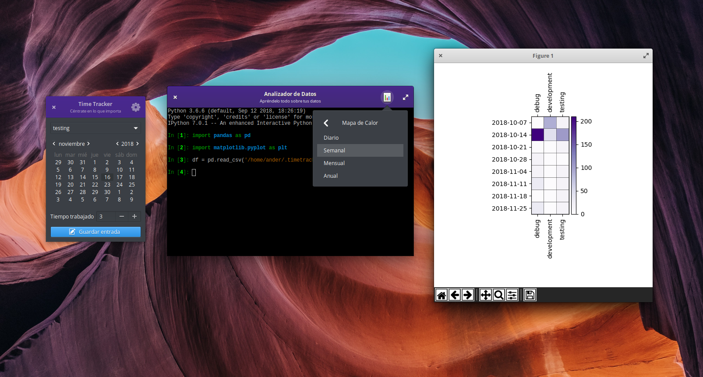

# TimeTracker

A simple time tracker built with Python3 and love.

## Features

+ Track how much time you spend on your activities.
+ Entries are saved on a `csv` file.

## Dependencies

+ Pandas
+ Numpy
+ Matplotlib
+ (Optional) Ipython3: this is for the terminal of the Analyzer window. If doesn't find it in your path it will use `python3` instead.

## How to run

### Method 1: Using Python3

From your terminal:

`$ python3 timetracker/__main__.py`

### Method 2 (Linux) Use desktop file

If your file manager allows it click on `timetracker.desktop`.

If you want to add TimeTracker to your applications menu change the `exec` line of the `.desktop` file and copy it to `~/.local/share/applications`.

